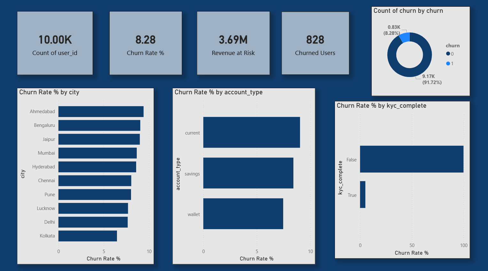

# 🏦 Customer Churn Analysis — Fintech (End-to-End)

## 📌 Problem Statement
Monthly active users dropped 8%. This project identifies **who is churning, why, and what to do about it** — simulating real fintech work in a Paytm/PhonePe context.

---

## 🛠️ Tools & Technologies
| Area | Tools |
|---|---|
| Data Generation | Python, Faker, NumPy |
| Data Storage | SQLite, CSV |
| Analysis | SQL (cohort, RFM, funnel), Python (pandas) |
| Visualization | Matplotlib, Seaborn (12+ charts) |
| Machine Learning | Scikit-learn, XGBoost |
| Dashboard | Power BI (4-page executive dashboard) |

---

## 📂 Project Structure
```
customer_churn/
  data/          → Raw CSVs + SQLite database
  notebooks/     → Jupyter notebooks (4 phases)
  powerbi/       → Exported CSVs for Power BI dashboard
  outputs/       → Saved plots and charts
```

---

## 🔄 Project Phases

### Phase 1 — Data Generation (`01_data_setup.ipynb`)
- Generated 10,000 simulated fintech user records across 4 tables: `users`, `transactions`, `app_events`, `support_tickets`
- Baked realistic churn patterns into data (overlapping distributions to simulate real behavior)

### Phase 2 — SQL Analysis (`02_sql_analysis.ipynb`)
- **Cohort Retention Matrix** — tracked user activity across 6 months post-signup
- **RFM Segmentation** — scored users on Recency, Frequency, Monetary value
- **Funnel Analysis** — measured drop-off from App Open → Transaction Success

### Phase 3 — Python EDA (`03_eda_features.ipynb`)
- Built master feature table joining all 4 data sources
- 12+ visualizations: distributions, boxplots (churned vs active), correlation heatmap, churn by city/KYC/account type

### Phase 4 — ML Model (`04_ml_model.ipynb`)
- Trained Logistic Regression (baseline) and XGBoost classifier
- Diagnosed and documented data leakage through feature importance analysis
- Rebuilt model with overlapping distributions for realistic signal
- **Top 3 churn drivers: Total Spend, KYC Completion, Account Balance**

### Phase 5 — Power BI Dashboard
- 4-page executive dashboard:
  - Page 1: Executive Overview (KPIs, churn by city/account type)
  - Page 2: Cohort & Retention heatmap + curves
  - Page 3: RFM & Customer Segments (treemap, scatter, bar)
  - Page 4: Behavioral Funnel & ML Feature Importance

---

## 📊 Key Findings
| Metric | Value |
|---|---|
| Overall Churn Rate | 8.28% |
| Churned Users | 828 out of 10,000 |
| Revenue at Risk | ₹3.69M |
| At-Risk Segment Revenue | ₹1.11M |
| Top Churn Driver | Total transaction spend |
| KYC Impact | Non-KYC users churn significantly more |

---

## 💡 Business Recommendations
1. **Target non-KYC users** with completion incentives — highest churn risk group
2. **Re-engage low-spend users** (< ₹1,000 total) before they hit 90 days of inactivity
3. **Focus retention campaigns** on Ahmedabad, Bengaluru, Jaipur (highest churn rate cities)

---

## 🚀 How to Run
```bash
# 1. Clone the repo
git clone https://github.com/YOUR_USERNAME/customer-churn-fintech.git

# 2. Install dependencies
pip install pandas numpy faker scikit-learn xgboost matplotlib seaborn

# 3. Run notebooks in order
#    01_data_setup.ipynb → 02_sql_analysis.ipynb → 03_eda_features.ipynb → 04_ml_model.ipynb
```

---

## 📸 Dashboard Preview

